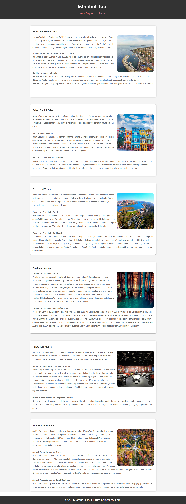

# :world_map: Blog Sitesi Projesi | Istanbul Tour

* Bu proje, Patika Frontend Bootcamp'i için oluşturulan **Hafta-2 / Ödev-1 / Blog Sitesi** projesidir.
* **CSS** alıştırması için bir pratik projesidir.
* **HTML** ve **CSS** kullanılmıştır.
---

## 📜 Sayfa Yapısı

:open_file_folder: **Klasörler;**
* *index.html*
* *post.html*
* *style.css*
* *img*

1. ***index.html***: Websitesi açıldığında Anasayfa karşılamaktadır. | 
    1.  Anasayfada **header** ve **header**in içinde **nav** bulunur. **nav** ile anasayfaya ve turlar sayfasına yönlendirme yapılır.
    2.  **Section** kısmında 6 tane **article** bulunur. İçlerinde 6 adet turun özet halinde bilgileri, 1 adet resmi ve detaylı bilgi için yönlendirme bulunur.
    3. **Footer**
2.  ***post.html:*** Turlar Sayfası; 
    1.  Aynı şekilde **header** ve **nav** bulunur.
    2. **Section** kısmında 6 adet **article** ile turlar hakkında istenen detaylı bilgiler bulunur. Anasayfadan bu içeriklere direkt olarak başlıklara yönlendirme yapılabilir.
    3. **Footer**
3.  ***style.css:*** index.html ve post.html için yazılan CSS özellikleri bu dosyada derlenmiştir. 
4. ***img:*** projede kullanılan blog resimlerinin bulunduğu klasör.

---

## :computer: Kullanım

1. Hafta-2 Projelerimin olduğu toplu repomu klonlayın.
*   git clone https://github.com/tunahanyasar/Hafta-2.git
2. Odev-1 dosyasını çalıştırın.

---

## 💡 Kullanılan Yapılar

**HTML:**
* Semantic Tags

**CSS:**
*  Flexbox

---

## :paperclip: Sayfa Çıktıları
### Anasayfa

### Turlar
