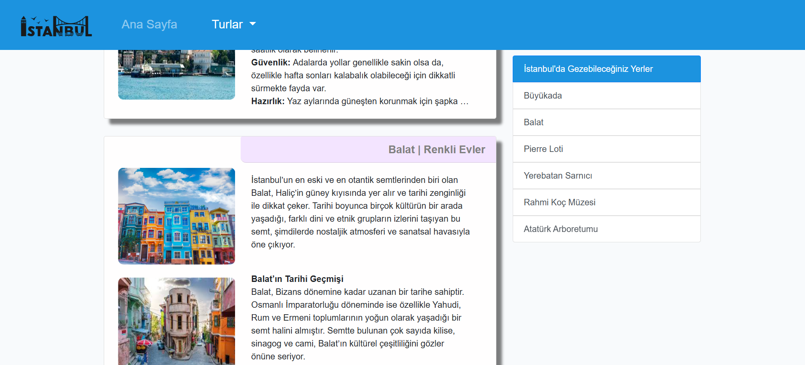
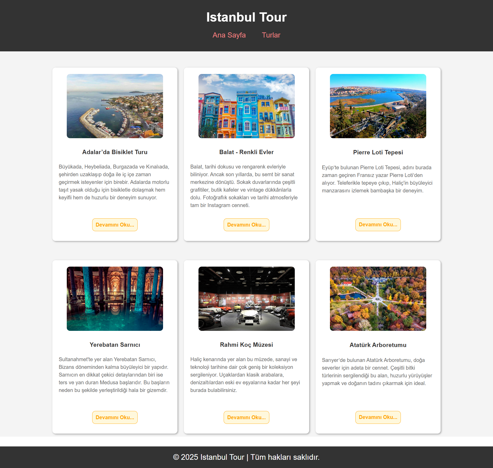
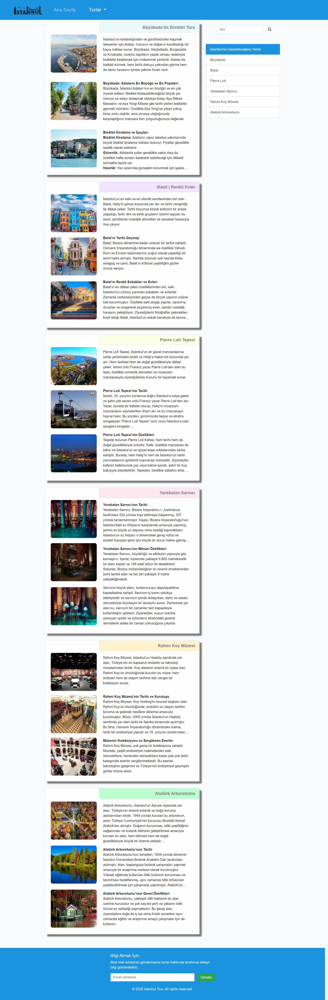

# :world_map: Blog Sitesi Projesi | Istanbul Tour

* Bu proje, Patika Frontend Bootcamp'i için oluşturulan **Hafta-3 / Ödev-1 / Blog Sitesi** projesidir. 
* **Hafta-2 / Ödev-1 / Blog Sitesi**nin bootstrap ile geliştirilmiş halidir.
* **Bootstrap 4** alıştırması için bir pratik projesidir.
* **HTML**, **CSS**, **Bootstrap 4** kullanılmıştır.
* Sayfanın style özellikleri **bootstrap 4** kullanılarak hazırlanmıştır.
---

## 📜 Sayfa Yapısı

:open_file_folder: **Klasörler;**
* *index.html*
* *post.html*
* *style.css*
* *img*
* *img-page*

1. ***index.html***: Websitesi açıldığında Anasayfa karşılamaktadır.
    1.  Anasayfada **header** ve **header**in içinde **nav** bulunur. **nav** ile anasayfaya ve turlar sayfasına **dropdown** ile yönlendirme yapılır.
    2.  **bootstrap** ile **jumbotron** eklenmiştir.
    3. **bootsrap** ile **carousel** eklenmiştir.
    4. **Aside** kısmında anasayfadaki **card**ların başlıklarına yönlendirme yapılır.
    5.  **Section** kısmında **card**ların içinde 6 tane **article** bulunur. İçlerinde 6 adet turun özet halinde bilgileri, 1 adet resmi ve detaylı bilgi için turlar sayfasına yönlendirme bulunur.
    6. **Footer**
2.  ***post.html:*** Turlar Sayfası; 
    1.  Ana sayfadaki şekliyle **header** ve **nav** bulunur.
    2. **Aside** kısmında turlar sayfasındaki **card**ların başlıklarına yönlendirme yapılır.
    2. **Section** kısmında 6 adet **article** ile turlar hakkında istenen detaylı bilgiler bulunur. Anasayfadan bu içeriklere direkt olarak başlıklara yönlendirme yapılabilir.
    3. **Footer**
3.  ***style.css:*** index.html ve post.html için yazılan CSS özellikleri bu dosyada derlenmiştir. 
4. ***img:*** projede kullanılan blog resimlerinin bulunduğu klasör.
5. **img-page**: **README.md** için oluşturulan görseller bu klasör içersinde bulunur.

---

## :computer: Kullanım

1. Hafta-3 projelerimin olduğu toplu repomu klonlayın.
*   git clone https://github.com/tunahanyasar/Hafta-3.git
2. Odev-1 dosyasını çalıştırın.

---
## :star2: Özellikler

1. **Bootsrap** in "sticky-top" classının sağladığı özellik ile Turlar sayfasındaki **sidebar** ın sayfada aşağı kaydırma yapılmasına rağmen yerinde sabit olması sağlanarak kullanıcılar için pratik gezinme sağlandı.

    

---

## 💡 Kullanılan Yapılar | Kazanımlar

**HTML:**
* Semantic Tags

**CSS:**

**Bootstrap 4**
* Grid | Row | Column
* Navbar
* Jumbotron
* Carousel
* List-group
* Cards

---

## :paperclip: Sayfa Çıktıları
### Anasayfa

### Turlar
