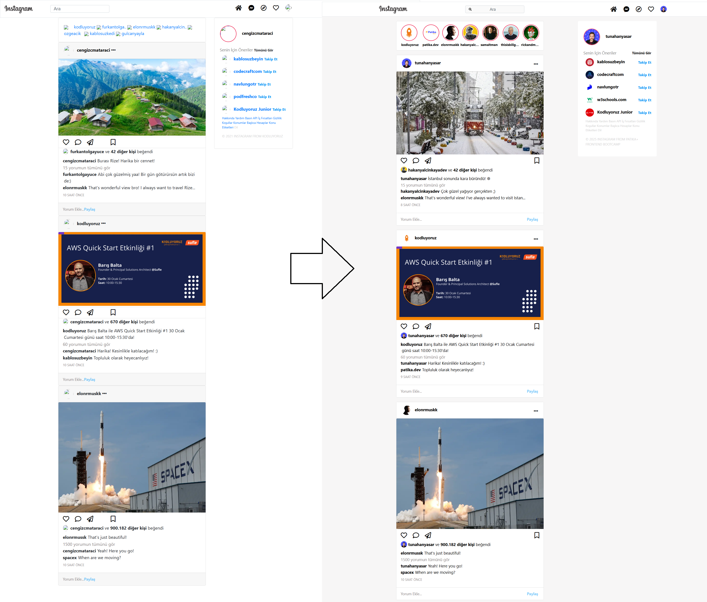
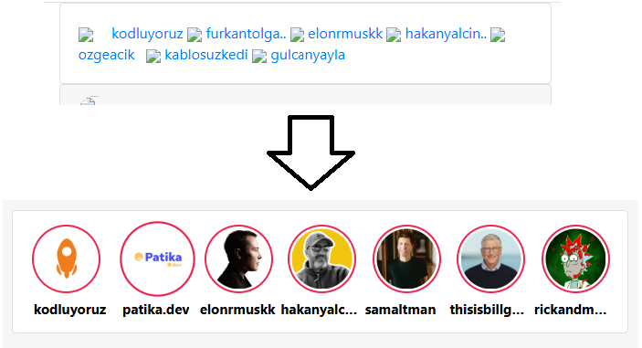
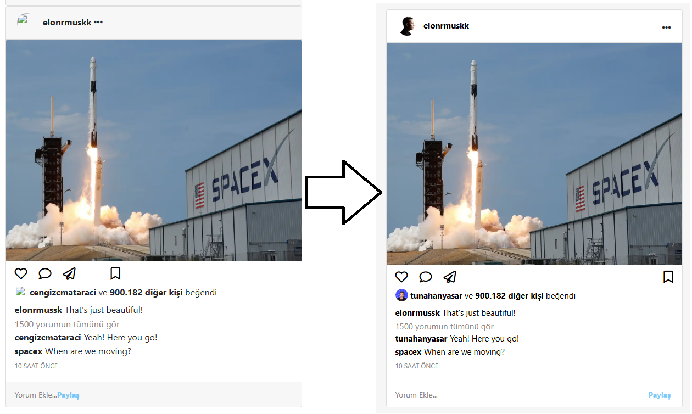
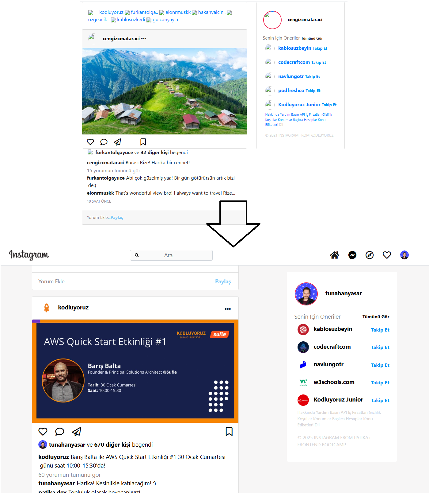
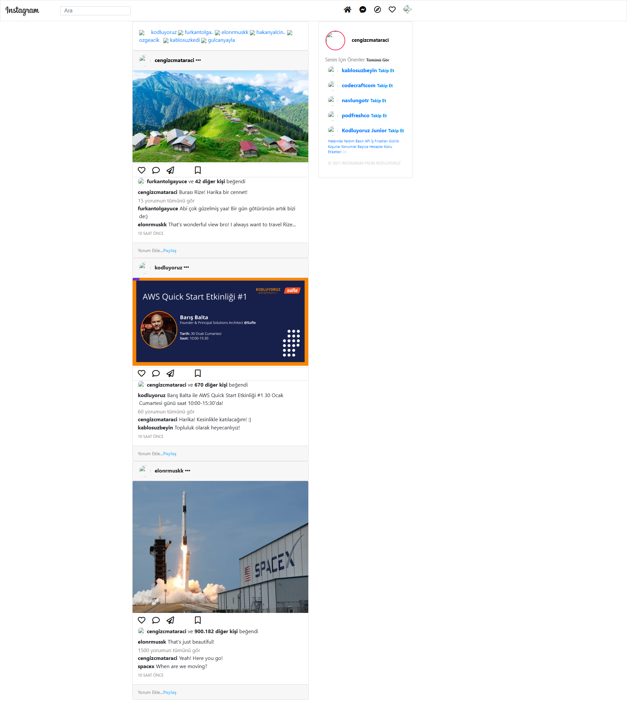
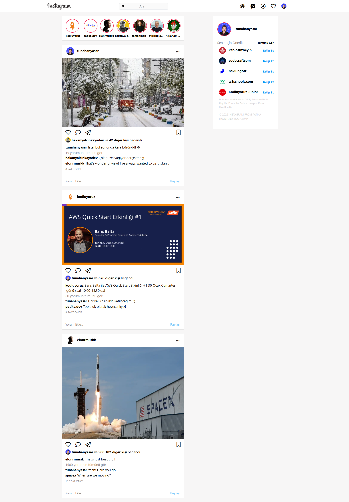

# :camera: Clone Projesi | Instagram

* Bu proje, Patika Frontend Bootcamp'i için oluşturulan **Hafta-3 / Ödev-2 / Instagram Clone** projesidir.
* **CSS ve Bootsrap** alıştırması için bir pratik projesidir.
* **HTML**, **CSS**, **Bootsrap** kullanılmıştır.
* Patika tarafından verilen Instagram Clone projesine **tasks.txt** içindeki adımları yerine getirerek **style** biçimlendirmesi yaptım.
---

## :computer: Kullanım

1. Hafta-3 projelerimin olduğu toplu repomu klonlayın.
*   git clone https://github.com/tunahanyasar/Hafta-3.git
2. Odev-2 dosyasını çalıştırın.

---

## 📜 Sayfa Yapısı

:open_file_folder: **Klasörler;**
* *index.html*
* *css* / *style.css*
* *assets*
* *img-page*
* *tasks.txt*

#### Yapılan Eklemeler: 
1.  ***Index.html / Navbar;***
    1. Navbar fixed-top özelliği eklendi.
    2.  Instagram logosu, boyutu ve menü iconları hızalamları yapıldı.
    3. search-bar kısmının **placeholder**ına CSS ile search iconu eklendi.
2.  ***Index.html / Story Area;***
    1. navbar ile arasına boşluk verildi.
    2. Karışık görseller ve yazılara detaylıca CSS özellikleri verildi.
3.  ***Index.html / Post Area;***
    1. Bootsrap ile responsive tasarım yapıldı.
    2. Post cardlarına ve içindeki öğelere hizalama ve renk özellikleri verildi.
4.  ***Index.html / Sidebar;***
    1. Sayfa hareket etse bile sağ tarafa yapışık olmasını sağlayan özellik ile **position: sticky;** hale getirildi.
    2. offset-1 verilerek sidebar bir kolonluk ötelenerek sağ tarafa alındı.
    3. İçindeki öğelerin hizalaması ve renk ayarları yapıldı.
5.  ***style.css:*** index.html için yazılan CSS özellikleri bu dosyada derlenmiştir. 
6. ***assets:*** projede kullanılan profil fotoğrafları ve post resimlerinin bulunduğu klasör.
7. ***img-page:*** README.md için oluşturulan sayfa çıktıları bu klasörde yer alıyor.

---

## 💡 Kullanılan Yapılar | Kazanımlar

**HTML:**

**CSS:**
*  !important
*  Pseudo-classes
*  Display

**BOOTSTRAP:**
*  Navbar
*  Grid-Column
*  Cards
*  Font-Icon 

---
## :star2: Yenilikler

### Main Page:

           

### Story Card:

            

### Post Card:

### Sidebar:

---

## :paperclip: Sayfa Çıktıları
### Without Style

### With Style

