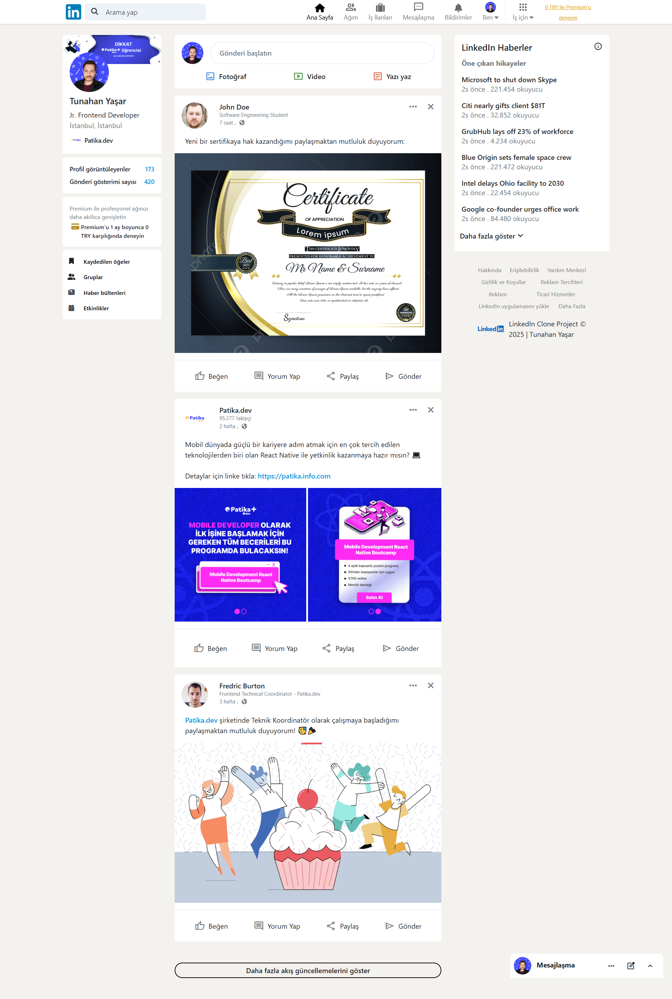
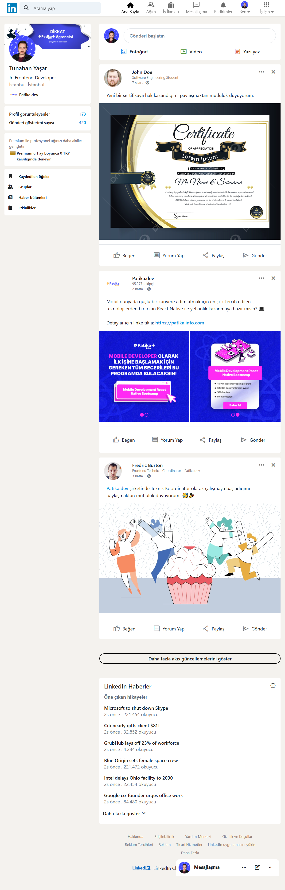
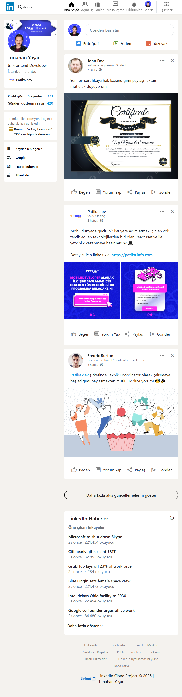

# :link::blue_square: Bootstrap Clone Projesi | Linkedin

* Bu proje, Patika Frontend Bootcamp'i için oluşturulan **Hafta-3 / Ödev-3 / Linkedin Clone** projesidir.
* **CSS** ve **Bootstrap 4** ile responsive tasarım alıştırması için bir pratik projesidir.
* **HTML**, **CSS**, **Bootstrap 4**  kullanılmıştır.
---

## :computer: Kullanım

1.  Hafta-3 projelerimin olduğu toplu repomu klonlayın.
*   git clone https://github.com/tunahanyasar/Hafta-3.git
2. Odev-3 dosyasını çalıştırın.

---

## 📜 Sayfa Yapısı

:open_file_folder: **Klasörler;**
* *index.html*
* *style.css*
* *img*
* *img-page*

1. ***index.html***: Websitesi açıldığında Linkedin Anasayfası karşılamaktadır.
    1.  Anasayfada **header** ve **header**in içinde **logo**, **searchbar**, **nav** bulunur. 
    2.  İçerik 3 **Left-Aside**, **Main** ve **Right-Aside**, **Fixed-Chat** kısımlarından oluşmaktadır.
        1.  **Left-Aside**, Linkedin ansayfası gibi solda profil cardı ve öğeleri bulunur.
        2.  **Main**, en üstte gönderi oluşturma cardı ve devamında kullanıcıların paylaşımlarının bulunduğu kısımdır.
        3. **Right-Aside**, haberler ve footer yönlendirmelerinin bulunduğu kısım.
        4. **Fixed-Chat**, sayfanın sağ en altına yapışık bir şekilde chat kısmı bulunur.

3.  ***style.css:*** index.html için Bootstrap ile desteklenmiş etiketlerin CSS özellikleri bu dosyada derlenmiştir. 
4. ***img:*** Projede kullanılan görsellerin bulunduğu klasör.
4. ***img-page:*** Projenin sayfa çıktılarının bulunduğu klasör.

---
## :star2: Özellikler

1. Tüm sayfaya ait responsive tasarım.
1. Position Fixed Header
2. Sticky Footer
3. Posiyion Fixed Aside-Footer

## 💡 Kullanılan Yapılar | Kazanımlar

**HTML:**
* Semantic Tags

**CSS:**
*  Flexbox
*  Pseudo-classes
* Grid
* Hover 
**Bootstrap 4**

**Ekler:**
*   Font-Awesome
* Google Material Symbols
*   https://randomuser.me

---

## :paperclip: Sayfa Çıktıları
### Full-Page

### Md-Page

### Sm-Page

### Xs-Page

